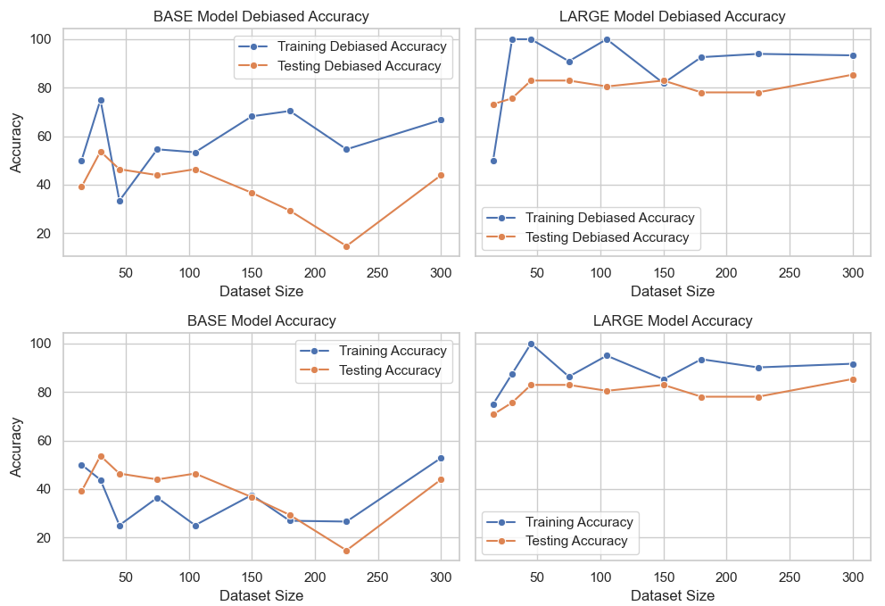
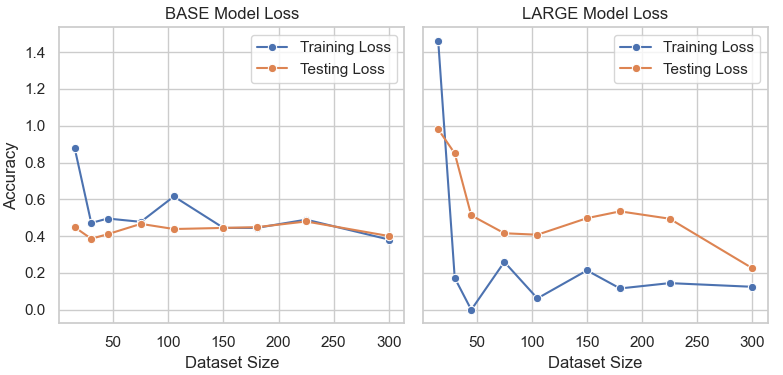
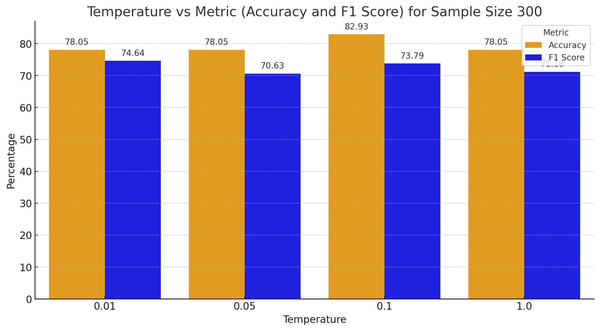
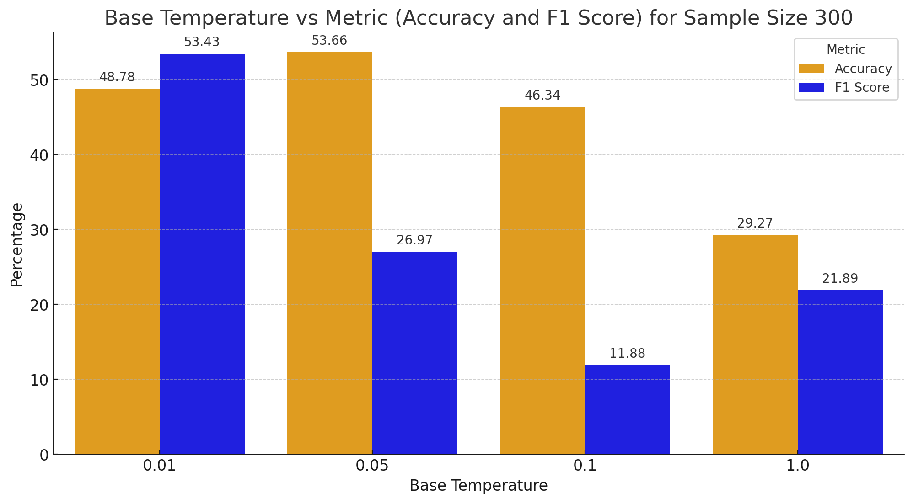

# Project Description

Quick Overview Deployed at: https://quiet-bubblegum-a79bb1.netlify.app/

## Introduction

We were tasked with creating a multiple-choice question dataset from Chapters 2, 3, 4 of James et al. "An Introduction to Statistical Learning with Applications in Python". Following this, we used the dataset to train and finetune Atlas models to understand the interplay between dataset, parameters, and the choice of the model. Atlas models are essentially a two-stage pipeline that does text retrieval and language generation. Both stages of this pipeline use pre-trained transformer models to incorporate relevant background knowledge into coherent natural language responses. The key factor in Atlas models is how it separates retrieval and generation, enabling it to scale to large datasets while still using sequence-to-sequence processes to perform language tasks. In our case, we used already existing models from Atlas and then trained and fine-tuned them. These steps covered a whole pipeline of an NLP model starting from dataset annotation, dataset splitting, preliminary tests on different models, training, and finally experimentation through tuning.

## Dataset

The dataset was split into train-validation-test as 75%-10%-15%. The dataset had 400 samples after a combination of manual and scripted processes of data extraction from the textbook. The training dataset was further split into sample sizes of 15, 30, 45, 75, 105, 150, 180, 225, and 300. These samples were then used iteratively as the tuning experiments were performed.

## Experiments

### Experiments with BASE and LARGE Models

For both Base and Large models, dataset sizes were varied across experiments to observe the impact on model learning. Here is the dataset-size configuration for both models:

**Parameters tuned:**
- Total Steps
- Temperature
- Text Maxlength
- Dropout
- N_context
- Learning Rate

**Fine-tuning configurations:**

| Parameters          | Value 1 | Value 2 | Value 3 | Value 4 |
|----------------------|---------|---------|---------|---------|
| Total Steps          | 200     | 400     | 600     | -       |
| Temperature Score    | 0.01    | 0.05    | 0.1     | 1       |
| Max length           | 128     | 256     | 512     | -       |
| Dropout              | 0.1     | 0.3     | 0.5     | -       |
| N_context Retriever | 10      | 30      | 50      | -       |
| Learning Rate        | 1.00E-05| 1.00E-04| 1.00E-03| -       |

**Total # of Experiments performed: 68**

### Base vs Large model

**Base vs Large model with parameter tuning**

## Experiment Results Table - Experiments- Final

### Scripts

- **Train test split:** Script to automatically split the dataset into train, validation, test dataset with size 75%, 10%, 15%. The script further divides the dataset into chunks as mentioned above.
- **Post Processing and Visualization Scripts:** Additional Evaluation Metrics (F1 score, Precision, Recall) - After evaluation, the model generates a test.jsonl file which includes query, answer, generation, logits, retrieved passages, and choice probabilities. We parsed through this file to extract TP, FP, FN, and TN to calculate the F1 score, Precision, and Recall. This additional step in evaluating the model using these metrics is critical, allowing for a deeper insight into the model's intricacies, going beyond basic accuracy metrics. By analyzing these metrics, we can pinpoint specific strengths and weaknesses in the model.

### Insights

- **Context Matters:** Providing more background information (N_Context) significantly boosted model accuracy, highlighting the importance of context for optimal performance.
- **Hyperparameter Tweaking:** Lower dropout and learning rates led to consistently better results across model sizes. Balanced temperature scores proved optimal, while extreme values negatively impacted accuracy. The ideal text length varied depending on the dataset size and model. Increasing total steps, representing computation time, had inconsistent effects on different experiments.
- **Beyond Higher Values:** Exceeding certain parameter thresholds, like dropout rate and learning rate, didn't always lead to better performance. Identifying the optimal balance for these parameters was crucial.
- **Automation for Efficiency and Reliability:** Automated processes, such as data splitting, ensured consistency and eliminated errors, enhancing result reliability.
- **Streamlined Evaluation:** An automated post-processing approach facilitated extracting evaluation metrics from data files, streamlining evaluation and enabling rapid performance analysis.
- **Customized Scripting:** A dedicated script calculated precision, recall, and F1 score specifically for Multiple-Choice Questions (MCQs), allowing for efficient task-specific evaluation and valuable insights.
- **Scripting and Experimentation:** Scripting and experimentation worked in synergy, showcasing an iterative and adaptable approach to model development. Scripting facilitated efficient experimentation by automating tasks and measurements.

### Comparison with the ATLAS paper

The paper highlights challenges in selecting hyperparameters in a few-shot setting. However, the specific parameters chosen in the paper align with the ones we chose as well, namely batch size, learning rate, retriever temperature, and train steps. Furthermore, ATLAS MMLU test set scores, as reported in the paper, generally demonstrate better performance in domains such as Humanities, Social Sciences, and Others compared to STEM. This observation suggests the potential for achieving better performance on non-STEM textbooks and passages using the same parameter settings in our experiments.

## Challenges

- **Dataset Creation Error:** Initially, our process of dataset creation met with challenges due to human error. The dataset was created by the members of the group. However, there was an error made in the structure of the dataset. The automated scripts that leveraged other NLP models performed admirably in creating a dataset quickly and accurately.
- **Availability Bottleneck:** When relying on an external resource such as HPC for a crucial part of the process, we quickly learned that availability was going to be a major bottleneck in this process. This meant that we had to create a systematic plan. No amount of planning can get past the lack of availability. As we were wrapping closer to the end of the semester, we found this to be a bigger problem. We were able to also overcome this by learning more about nodes and partitions within the HPC to utilize free resources and not just rely on random assignment.

## Conclusion

With our experiments, we found that the best model was the large model with the following parameters:
- Total Steps: 600
- Temperature/Gold Score: 0.1
- Text max length: 512
- N context: 50
- Learning rate: 1e-5
- Dropout: 0.1
